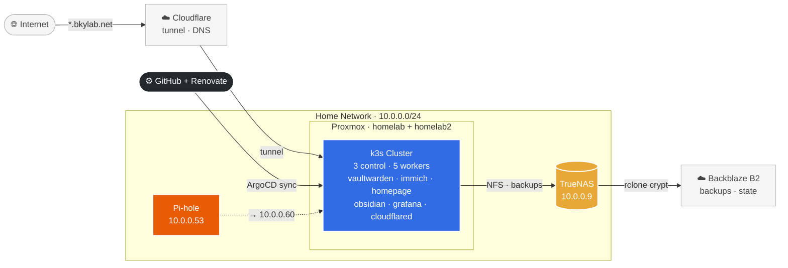

# homelab

Personal homelab managed as code. Two Proxmox nodes running an 8-node k3s cluster, with TrueNAS for storage and ArgoCD for GitOps. Infrastructure provisioned with OpenTofu + Ansible; workloads deployed via ArgoCD App-of-Apps targeting this repo.



See [docs/architecture.md](docs/architecture.md) for detailed infrastructure, traffic flow, GitOps pipeline, and storage diagrams. For a full cluster rebuild, follow [docs/runbook-disaster-recovery.md](docs/runbook-disaster-recovery.md).

## Prerequisites

On a fresh machine, generate the SSH key pairs used for provisioning before running anything else:

```bash
./scripts/generate-keys.sh
```

This creates `~/.ssh/homelab` (LXC containers) and `~/.ssh/k3s_cluster` (k3s VMs) if they don't already exist.

Proxmox must also have VM templates available (IDs 9000 and 9001) — Debian cloud-init images with `qemu-guest-agent` installed.

## Full Setup Flow

One-time prerequisites (fresh machine): SSH keys (`./scripts/generate-keys.sh`), tofu vars
(`proxmox/tofu/variables.auto.tfvars`), and the Ansible vault (`.vault_pass` +
`group_vars/all/vault.yml` with `k3s_token`, see Ansible setup below).

All commands from the repo root:

```bash
tofu -chdir=proxmox/tofu apply                                    # provision VMs + LXC
cd proxmox/ansible
./run-playbook.sh playbooks/baseline.yml                          # base packages on LXC
./run-playbook.sh playbooks/pihole.yml                            # DNS first: k3s nodes resolve via 10.0.0.53
./run-playbook.sh playbooks/k3s.yml                               # install k3s on all nodes
./run-playbook.sh playbooks/k3s_disk_prep.yml                     # prep Longhorn disks on workers
cd ../..
./scripts/bootstrap.sh                                            # fresh: seal secrets + install infra
git push origin <branch>                                          # commit newly sealed secrets
```

Verify Pi-hole before running `k3s.yml`: `dig @10.0.0.53 google.com +short`.

**Rebuilding an existing cluster?** Do NOT run `bootstrap.sh` blindly. The sealed-secrets
controller private key must be restored from the Bitwarden backup BEFORE anything syncs,
or every SealedSecret in git is unreadable. Follow
[docs/runbook-disaster-recovery.md](docs/runbook-disaster-recovery.md), which uses
`playbooks/k3s_bootstrap.yml` (no interactive prompts, applies sealed secrets from git).

## OpenTofu

All infrastructure is managed from `proxmox/tofu`.

**Setup (first time):**
1. Copy the example vars file: `cp variables.auto.tfvars.example variables.auto.tfvars`
2. Fill in `variables.auto.tfvars` with your Proxmox endpoint, API token, node name, and datastores
3. Run `tofu init` to download providers
4. Run `tofu plan` to preview changes
5. Run `tofu apply` to provision

`tofu apply` also generates `proxmox/ansible/inventory.ini` from the live VM state.

**State:** Remote state is stored in Backblaze B2 (`bkylab-tofu-state`, S3-compatible backend). Credentials are loaded from `~/.config/homelab/tofu.env` before running `tofu` commands. See `proxmox/tofu/provider.tf` for backend config.

**What gets created:**

| Resource | IDs | Description |
|---|---|---|
| LXC: `pihole` | 303 | Pi-hole DNS container |
| VM: `k3s-control-1/2/3` | 310–312 | k3s control plane nodes (all on homelab2; API HA via kube-vip VIP 10.0.0.59, host-level HA needs a 3rd node) |
| VM: `k3s-worker-1/2/3` | 320–322 | k3s worker nodes |
| VM: `k3s-worker-4/5` | 323–324 | k3s worker nodes, 100GB Longhorn disks |

## Ansible Playbooks

Playbooks are run from the `proxmox/ansible` directory using `run-playbook.sh`:

```bash
cd proxmox/ansible
./run-playbook.sh playbooks/<playbook>.yml --private-key ~/.ssh/<key>
```

**Setup (first time):**
1. Create a vault password file: `echo "your-password" > .vault_pass && chmod 600 .vault_pass`
2. Create the vault with secrets: `ansible-vault create group_vars/all/vault.yml`
   - Add `k3s_token: "your-cluster-secret"` for k3s playbooks
3. `tofu apply` generates `inventory.ini` automatically from VM state

**Available playbooks:**

| Playbook | Hosts | Description |
|---|---|---|
| `playbooks/baseline.yml` | `lxc_host` | Base packages and SSH for LXC containers |
| `playbooks/pihole.yml` | `pihole` | Pi-hole DNS install and configuration |
| `playbooks/k3s.yml` | `k3s-control`, `k3s-workers` | k3s cluster setup (control plane + workers) |
| `playbooks/k3s_disk_prep.yml` | `k3s-workers` | Prepare extra disks for Longhorn storage |
| `playbooks/k3s_bootstrap.yml` | `k3s-control[0]` | Install ArgoCD, Longhorn, Sealed Secrets via Helm; apply sealed secrets from git; kick off App-of-Apps. Run after `k3s.yml`. |

**Examples:**
```bash
./run-playbook.sh playbooks/k3s.yml --private-key ~/.ssh/k3s_cluster
./run-playbook.sh playbooks/pihole.yml
./run-playbook.sh playbooks/baseline.yml --limit=pihole
```

## k3s Cluster Bootstrap

After `k3s.yml` has run, one of two bootstrap paths finishes the cluster setup:

**Fresh cluster (secrets not yet sealed):** Run `scripts/bootstrap.sh` from your Mac. It installs local tools, copies kubeconfig, prompts for secret values and seals them with `kubeseal`, installs ArgoCD/Longhorn/Sealed Secrets via Helm, and kicks off the App-of-Apps.
```bash
./scripts/bootstrap.sh
```

**Rebuild (sealed secrets already committed to git):** Run the Ansible playbook instead — no interactive prompts needed.
```bash
./run-playbook.sh playbooks/k3s_bootstrap.yml --private-key ~/.ssh/k3s_cluster
```

> **Why Longhorn is installed via Helm and not ArgoCD:** Longhorn's pre-upgrade Helm hook requires a ServiceAccount that doesn't exist until the chart installs it, which fails on a fresh cluster deploy. The bootstrap script installs it directly and ArgoCD adopts and manages it.
>
> After the initial helm install, re-enable ArgoCD auto-sync for Longhorn:
> ```bash
> kubectl patch application longhorn -n argocd --type merge \
>   -p '{"spec":{"syncPolicy":{"automated":{"prune":true,"selfHeal":true}}}}'
> ```

## GitOps (ArgoCD)

All Kubernetes workloads are managed via ArgoCD using the App-of-Apps pattern.

- App definitions: `k8s/apps/`
- Bootstrap manifests: `k8s/bootstrap/argocd/`
- Infrastructure configs (Longhorn recurring jobs, etc.): `k8s/infrastructure/`

ArgoCD notifications are configured in `k8s/bootstrap/argocd/values.yaml`. Each app is annotated to subscribe to sync and health triggers, which send to a Telegram group via a configured bot.

**Services managed:**

| App | Namespace | Notes |
|---|---|---|
| Vaultwarden | `vaultwarden` | Password manager, RWO Longhorn PVC |
| Immich | `immich` | Photo library, photos on NFS (TrueNAS), DB on Longhorn |
| Homepage | `homepage` | Dashboard at `home.bkylab.net`, Cloudflare Access protected |
| Obsidian | `obsidian` | CouchDB backend for Obsidian notes sync at `obsidian.bkylab.net` |
| Cloudflared | `cloudflared` | Cloudflare tunnel — routes all `*.bkylab.net` public services |
| kube-prometheus-stack | `monitoring` | Prometheus + Grafana + Alertmanager. Grafana at `grafana.bkylab.net`. Alerts → Telegram via Alertmanager |
| Longhorn | `longhorn-system` | Distributed block storage, daily backups + weekly snapshots |
| Sealed Secrets | `kube-system` | Encrypts secrets for safe git storage |
| Reloader | `reloader` | Auto-restarts pods when their ConfigMap or Secret changes |
| kube-vip | `kube-system` | Floating VIP 10.0.0.59 for the k8s API across all 3 control nodes |

## Secrets

Secrets are managed with [Sealed Secrets](https://github.com/bitnami-labs/sealed-secrets). Encrypted `SealedSecret` manifests are committed to git; the in-cluster controller decrypts them.

To re-seal a secret (e.g. after rotating a credential):
```bash
kubectl create secret generic <name> -n <namespace> \
  --from-literal=key=value \
  --dry-run=client -o yaml \
| kubeseal \
    --controller-name=sealed-secrets-controller \
    --controller-namespace=kube-system \
    --format yaml > k8s/apps/<app>/sealed-secret.yaml
```

Never commit plaintext secrets. Files matching `secrets-local/` and `*.plaintext.yaml` are gitignored.

## CI

Every push runs lint and validation in GitHub Actions (`.github/workflows/ci.yml`):
yamllint, `tofu validate`/`fmt`, ansible-lint, kubeconform, gitleaks (secret scanning over
full history), kube-linter (k8s security lint), and helm-render (charts templated against
the repo values files). Chart versions in helm-render are read from the ArgoCD app
manifests so CI always tests what is deployed.

## E2E Test Environment

Provisioning changes (Ansible roles, `bootstrap.sh`, tofu) can be verified against a real
throwaway cluster before merging: 1 control + 1 worker VM on the homelab node, provisioned
by OpenTofu (`proxmox/tofu/test-env`, local state, never touches prod state) through the
same clone + cloud-init path as prod.

```bash
./scripts/test-env.sh up                # tofu apply, generates test-inventory.ini
cd proxmox/ansible && ansible-playbook -i test-inventory.ini playbooks/k3s.yml \
  -e "k3s_vip=10.0.0.239 k3s_token=test-token"
cd ../.. && ./scripts/test-env.sh verify   # all nodes joined and Ready
./scripts/test-env.sh down              # tofu destroy
```

`.github/workflows/e2e.yml` runs the same sequence on a self-hosted runner, manual
trigger only (`workflow_dispatch`): Renovate PRs never spin up VMs, and fork PRs cannot
run code on the LAN runner.
