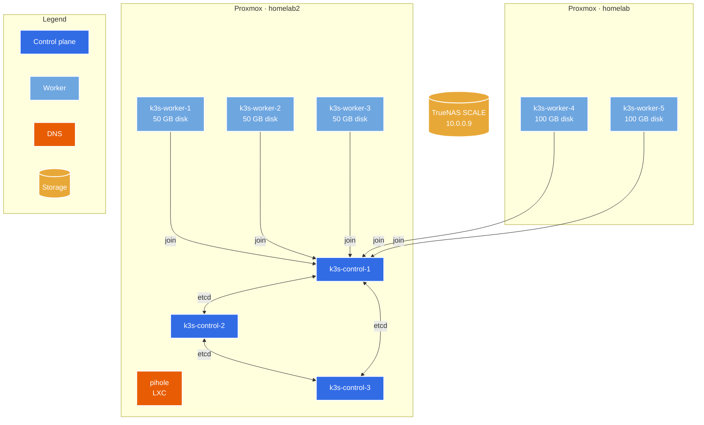
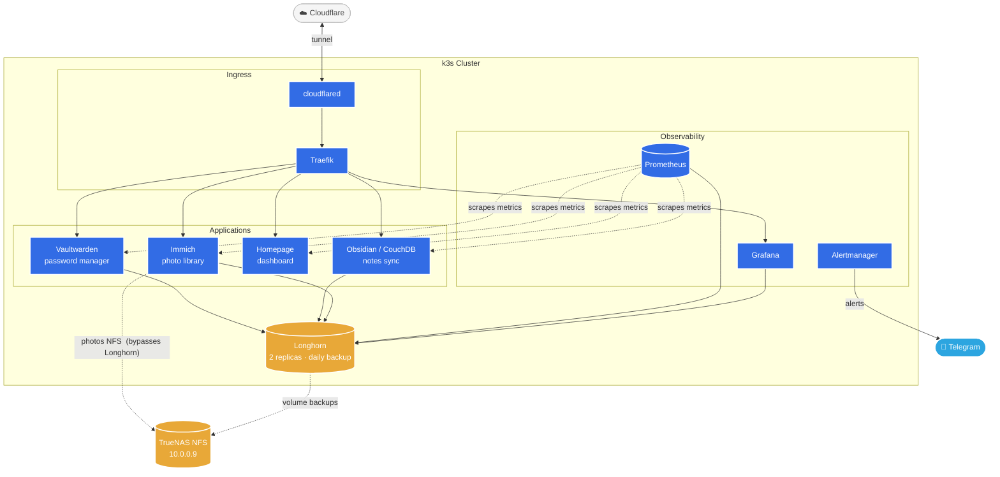
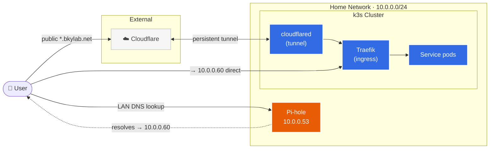
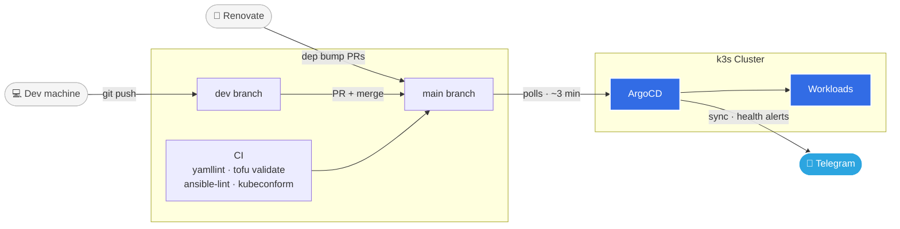
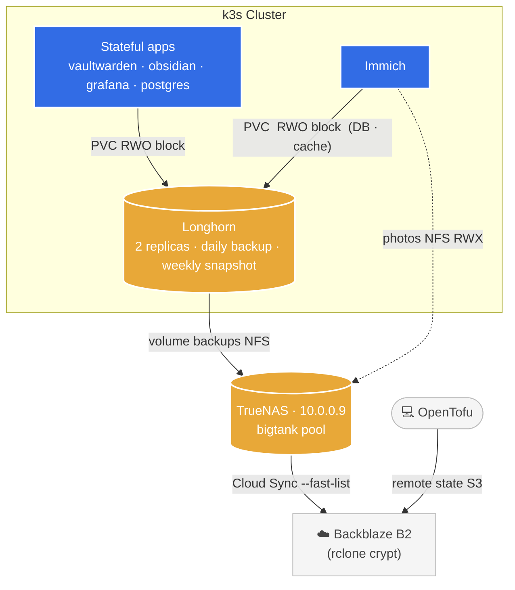

# Architecture

## Physical Infrastructure

Two Proxmox hosts and a separate TrueNAS storage server on a flat `10.0.0.0/24` home network. OpenTofu provisions all VMs declaratively; Ansible configures them. `homelab2` is the primary node (runs control plane + most workers); `homelab` hosts the two workers with large Longhorn disks.

| Host | IP | Role | Proxmox node | vCPU | RAM | Longhorn disk |
|---|---|---|---|---|---|---|
| `pihole` | `10.0.0.53` | Pi-hole DNS (LXC) | homelab2 | 1 | 512 MB | — |
| `k3s-control-1` | `10.0.0.60` | Control plane | homelab2 | 2 | 4 GB | 50 GB |
| `k3s-control-2` | `10.0.0.61` | Control plane | homelab2 | 2 | 4 GB | 50 GB |
| `k3s-control-3` | `10.0.0.62` | Control plane | homelab2 | 2 | 4 GB | 50 GB |
| `k3s-worker-1` | `10.0.0.70` | Worker | homelab2 | 2 | 4 GB | 50 GB |
| `k3s-worker-2` | `10.0.0.71` | Worker | homelab2 | 2 | 4 GB | 50 GB |
| `k3s-worker-3` | `10.0.0.72` | Worker | homelab2 | 2 | 4 GB | 50 GB |
| `k3s-worker-4` | `10.0.0.73` | Worker | homelab | 2 | 4 GB | 100 GB |
| `k3s-worker-5` | `10.0.0.74` | Worker | homelab | 2 | 4 GB | 100 GB |
| TrueNAS | `10.0.0.9` | NAS / backup target | bare metal | — | — | 2×12 TB mirror + spare |

> **HA note:** Workers currently connect to `ctrl1`'s API server directly (`10.0.0.60:6443`). etcd tolerates losing one control plane node, but workers lose API connectivity if ctrl1 goes down. A kube-vip VIP in front of all three control plane nodes is a planned improvement.

## k3s Cluster Services

Workloads are managed by ArgoCD via GitOps. Traefik is the ingress controller; Cloudflared maintains an outbound tunnel to Cloudflare so external traffic never requires open router ports. Longhorn provides distributed block storage; Immich photos bypass Longhorn and mount directly from TrueNAS over NFS.

## Network & Traffic Flow

External services are exposed through a Cloudflare tunnel — no ports opened on the router. The Cloudflared pod maintains a persistent outbound connection; Cloudflare proxies `*.bkylab.net` traffic inbound through it. Internal access uses Pi-hole DNS records that resolve `*.bkylab.net` to `10.0.0.60`, hitting Traefik directly without leaving the LAN.

**Public** (Cloudflare tunnel): `home.bkylab.net`, `obsidian.bkylab.net`, `grafana.bkylab.net`

**LAN-only** (Pi-hole DNS → `10.0.0.60`): `argocd.bkylab.net`, `longhorn.bkylab.net`

## GitOps Pipeline

ArgoCD polls the `main` branch and syncs any drift within ~3 minutes. All feature work goes to `dev` first — ArgoCD apps target `dev` during development. Renovate runs as a GitHub App and opens automated PRs for Helm chart, container image, and GitHub Actions version bumps; `renovate.json` blocks major upgrades for Longhorn and PostgreSQL which need manual procedures.

CI runs on every push and PR:
- **yamllint** — YAML syntax and style on `k8s/` and Ansible files
- **tofu validate + fmt** — Terraform syntax and formatting
- **ansible-lint** — Ansible best practices
- **kubeconform** — validates Kubernetes manifests against upstream schemas

## Storage Architecture

Storage is layered: Longhorn provides distributed block storage for most workloads; Immich photos use a direct NFS mount to TrueNAS to avoid routing bulk media storage through the cluster. Longhorn takes daily volume backups to TrueNAS over NFS, and TrueNAS syncs everything offsite to Backblaze B2 via rclone with client-side encryption.

**StorageClass:**
- `longhorn-retain` — Vaultwarden, Immich-postgres, Obsidian. `reclaimPolicy: Retain` survives accidental namespace deletion.
- `longhorn` (Delete) — monitoring stack. Acceptable to reprovision on cluster rebuild.

**B2 cost:** `--fast-list` batches LIST calls into Class B operations, staying under the 2,500/day Class C free-tier cap.
