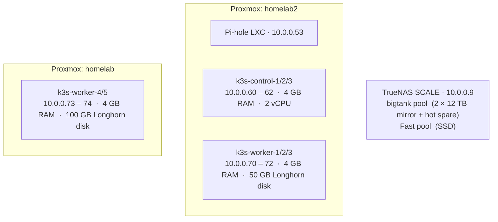
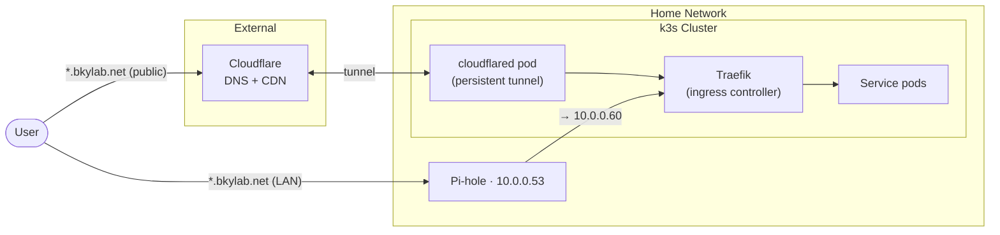
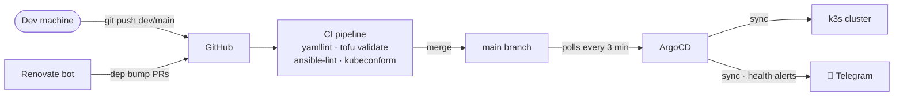
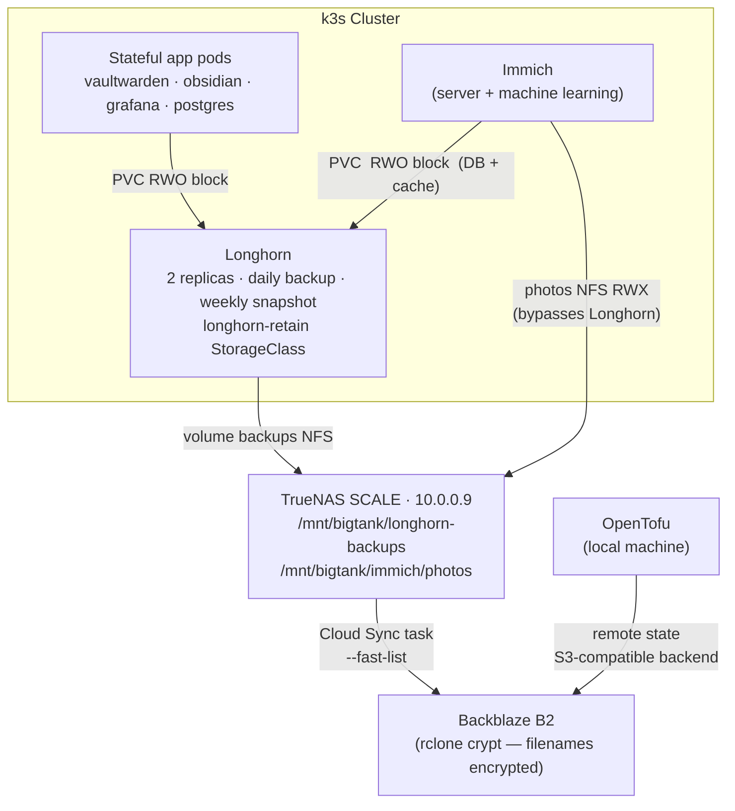

# Architecture

## Physical Infrastructure

Two Proxmox hosts and a separate TrueNAS storage server on a flat 10.0.0.0/24 home network. OpenTofu provisions all VMs declaratively; Ansible configures them. `homelab2` is the primary node (runs control plane + most workers); `homelab` hosts the two workers with large Longhorn disks.

## Network & Traffic Flow

External services are exposed through a Cloudflare tunnel — no ports opened on the router. The Cloudflared pod inside the cluster maintains an outbound tunnel to Cloudflare, which proxies `*.bkylab.net` traffic inbound. Internal access uses Pi-hole DNS records that resolve `*.bkylab.net` to `10.0.0.60` (the first control node), hitting Traefik directly without leaving the LAN.

**Public services** (Cloudflare tunnel): `home.bkylab.net`, `obsidian.bkylab.net`, `grafana.bkylab.net`

**LAN-only** (Pi-hole DNS only): `argocd.bkylab.net`, `longhorn.bkylab.net`

## GitOps Pipeline

All Kubernetes workloads are managed via ArgoCD using the App-of-Apps pattern. ArgoCD polls the `main` branch of this repo; changes merged to `main` are automatically synced to the cluster within ~3 minutes. Feature work targets the `dev` branch — ArgoCD apps point at `dev` for active development, with `main` as the stable target.

Renovate runs as a GitHub App and opens automated PRs for dependency bumps (Helm charts, container images, GitHub Actions). Version pinning rules in `renovate.json` block major upgrades for Longhorn and PostgreSQL, which require manual upgrade procedures.

CI runs on every push and PR:
- **yamllint** — YAML syntax and style on `k8s/` and Ansible files
- **tofu validate + fmt** — Terraform syntax and formatting
- **ansible-lint** — Ansible best practices (37 violations fixed to reach clean baseline)
- **kubeconform** — validates Kubernetes manifests against upstream schemas (strict mode)

## Storage Architecture

Storage is layered: Longhorn provides distributed block storage for most workloads; Immich photos use a direct NFS mount to TrueNAS to avoid copying 100+ GB through the cluster. Longhorn takes daily volume backups to TrueNAS over NFS, and TrueNAS syncs everything offsite to Backblaze B2 via rclone with client-side encryption.

**StorageClass notes:**
- `longhorn-retain` — used by Vaultwarden, Immich-postgres, Obsidian. `reclaimPolicy: Retain` so PVCs survive accidental namespace deletion.
- `longhorn` (Delete) — used by monitoring stack (Prometheus, Grafana, Alertmanager). Acceptable to lose and reprovision.

**B2 cost note:** `--fast-list` enabled on the TrueNAS Cloud Sync task to batch LIST operations into Class B calls, avoiding the 2,500/day Class C free-tier cap on large datasets.
